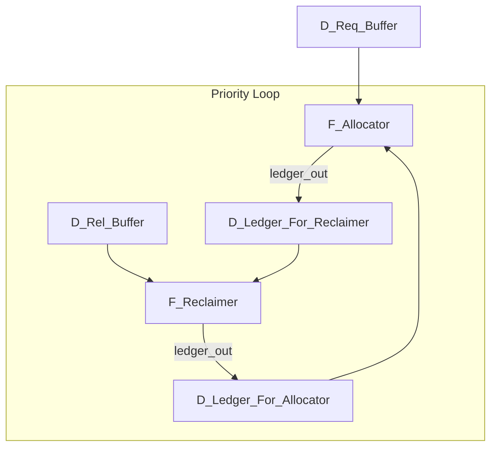

**最终拓扑方案 (The Conveyor Belt Priority Loop):**
我们将创建一个单向的、强制的循环，`Ledger` 令牌必须按顺序流过 `Allocator` 和 `Reclaimer`。

**工作流程:**
1.  `F_Allocator` **只能**从 `D_Ledger_For_Allocator` 获取 `Ledger` 令牌。
2.  执行后（无论成功授予还是失败拒绝），`F_Allocator` **必须**将 `Ledger` 令牌放入 `D_Ledger_For_Reclaimer`。此时，`F_Allocator` 物理上被阻塞，因为它唯一的输入源是空的。
3.  `F_Reclaimer` 现在可以从 `D_Ledger_For_Reclaimer` 获取 `Ledger` 令牌（如果 `D_Rel_Buffer` 也有令牌）。
4.  `F_Reclaimer` 执行后，将更新后的、更“富裕”的 `Ledger` 令牌放回 `D_Ledger_For_Allocator`。
5.  `F_Allocator` 现在可以再次尝试分配。

这个设计从物理上保证了每一次分配尝试之后，都必然会给 `Reclaimer` 一个执行的机会。**它用拓扑结构根除了死锁。**

## [WIP] fix(compiler): 引入资源循环拓扑以根除 Allocator/Reclaimer 死锁

### 错误分析
`Allocator` 和 `Reclaimer` 对共享的 `Ledger` 节点的对称访问模式，在高负载和资源匮乏时会产生“请求风暴”活锁，最终导致 `Reclaimer` 被饿死，系统死锁。逻辑层面的修复不足以在异步调度中完全避免此竞争。

### 用户需求
通过修改 `Builder` 生成的物理拓扑，为 `Ledger` 令牌创建一个单向循环，从物理上保证 `Reclaimer` 的执行优先级高于 `Allocator` 的重试，从而根除死锁。

### 评论
这是一个从架构层面解决并发问题的绝佳范例。我们没有去修改 `Reactor` 的核心调度逻辑，也没有让 IC 变得更“聪明”，而是通过净化物理连接的拓扑结构，让正确的行为“自然涌现”。“传送带”模型将 `Ledger` 令牌的流转从混乱的竞争状态，变成了可预测的、确定性的状态迁移，这是 Cascade 物理化思想的完美体现。

### 目标
1.  修改 `packages/cascade-compiler/src/cascade/compiler/backend/builder.py`。
2.  将单一的 `D_ledger` 节点拆分为两个：`d_ledger_alloc_in` 和 `d_ledger_reclaim_in`。
3.  重分布线，构建 `Allocator -> d_ledger_reclaim_in -> Reclaimer -> d_ledger_alloc_in -> Allocator` 的单向循环。

### 标签
#intent/fix #flow/ready #priority/critical #comp/compiler #concept/topology #concept/concurrency #scope/core #task/domain/core #task/object/compiler #task/action/deadlock-fix #task.state/continue

---

### Script

#### Acts 1: 在 `builder.py` 中实现“传送带”拓扑

我们将对 `Builder` 的资源创建部分进行一次外科手术，重构 `Ledger` 相关的布线。

~~~~~act
patch_file
packages/cascade-compiler/src/cascade/compiler/backend/builder.py
~~~~~
~~~~~python.old
        # 1. Create Resource Brokers (Allocators + Reclaimers)
        for res_def in environment.resources:
            allocator_id = PhysicalIdGenerator.global_allocator(res_def.name)
            reclaimer_id = PhysicalIdGenerator.global_reclaimer(res_def.name)
            ledger_id = PhysicalIdGenerator.global_ledger(res_def.name)

            # D_ledger
            initial_ledger = DiscreteLedger(
                total=res_def.capacity, available=res_def.capacity
            )
            d_ledger = PhysicsDataNode(
                id=ledger_id,
                name=f"Ledger({res_def.name})",
                capacity=1,
                initial_tokens=1,
                initial_payload=initial_ledger,
            )
            wire.add_node(d_ledger)

            # F_reclaimer (Priority High: Must release before allocate to avoid starvation)
            f_reclaimer = PhysicsFuncNode(
                id=reclaimer_id,
                name=f"Reclaimer({res_def.name})",
                input_ports={
                    PortName.LEDGER_IN: PortDef(PortName.LEDGER_IN, PortRole.DATA),
                    PortName.REL: PortDef(PortName.REL, PortRole.DATA),
                },
                output_ports={
                    PortName.LEDGER_OUT: PortDef(PortName.LEDGER_OUT, PortRole.DATA),
                },
            )
            wire.add_node(f_reclaimer)

            # F_allocator (Priority Low)
            # NOTE: Dynamic grant ports (gnt_for_...) will be added during wiring phase
            f_allocator = PhysicsFuncNode(
                id=allocator_id,
                name=f"Allocator({res_def.name})",
                input_ports={
                    PortName.LEDGER_IN: PortDef(PortName.LEDGER_IN, PortRole.DATA),
                    PortName.REQ: PortDef(PortName.REQ, PortRole.DATA),
                },
                output_ports={
                    PortName.LEDGER_OUT: PortDef(PortName.LEDGER_OUT, PortRole.DATA),
                    # PortName.GNT is deprecated in favor of dynamic ports, but kept for fallback
                    PortName.GNT: PortDef(PortName.GNT, PortRole.RESOURCE),
                    PortName.REQ_OUT: PortDef(PortName.REQ_OUT, PortRole.DATA),
                },
            )
            wire.add_node(f_allocator)

            # Wiring: Ledger <-> Allocator
            wire.connect(ledger_id, "out", allocator_id, PortName.LEDGER_IN)
            wire.connect(allocator_id, PortName.LEDGER_OUT, ledger_id, "in")

            # Wiring: Ledger <-> Reclaimer
            wire.connect(ledger_id, "out", reclaimer_id, PortName.LEDGER_IN)
            wire.connect(reclaimer_id, PortName.LEDGER_OUT, ledger_id, "in")
~~~~~
~~~~~python.new
        # 1. Create Resource Brokers (Allocators + Reclaimers)
        for res_def in environment.resources:
            allocator_id = PhysicalIdGenerator.global_allocator(res_def.name)
            reclaimer_id = PhysicalIdGenerator.global_reclaimer(res_def.name)
            
            # --- Conveyor Belt Topology for Deadlock Prevention ---
            # We create two ledger data nodes to enforce a one-way flow.
            # D_ledger_alloc_in: High-priority, only Reclaimer writes here.
            # D_ledger_reclaim_in: Low-priority, only Allocator writes here.
            
            alloc_in_id = PhysicalIdGenerator.global_ledger(res_def.name, "alloc_in")
            reclaim_in_id = PhysicalIdGenerator.global_ledger(res_def.name, "reclaim_in")

            initial_ledger = DiscreteLedger(
                total=res_def.capacity, available=res_def.capacity
            )
            
            # This is the starting point of the loop, pre-filled with the ledger token.
            d_ledger_alloc_in = PhysicsDataNode(
                id=alloc_in_id,
                name=f"LedgerAllocIn({res_def.name})",
                capacity=1,
                initial_tokens=1,
                initial_payload=initial_ledger,
            )
            wire.add_node(d_ledger_alloc_in)
            
            # This is the intermediate point. It starts empty.
            d_ledger_reclaim_in = PhysicsDataNode(
                id=reclaim_in_id,
                name=f"LedgerReclaimIn({res_def.name})",
                capacity=1,
            )
            wire.add_node(d_ledger_reclaim_in)

            # F_reclaimer
            f_reclaimer = PhysicsFuncNode(
                id=reclaimer_id,
                name=f"Reclaimer({res_def.name})",
                input_ports={
                    PortName.LEDGER_IN: PortDef(PortName.LEDGER_IN, PortRole.DATA),
                    PortName.REL: PortDef(PortName.REL, PortRole.DATA),
                },
                output_ports={
                    PortName.LEDGER_OUT: PortDef(PortName.LEDGER_OUT, PortRole.DATA),
                },
            )
            wire.add_node(f_reclaimer)

            # F_allocator
            f_allocator = PhysicsFuncNode(
                id=allocator_id,
                name=f"Allocator({res_def.name})",
                input_ports={
                    PortName.LEDGER_IN: PortDef(PortName.LEDGER_IN, PortRole.DATA),
                    PortName.REQ: PortDef(PortName.REQ, PortRole.DATA),
                },
                output_ports={
                    PortName.LEDGER_OUT: PortDef(PortName.LEDGER_OUT, PortRole.DATA),
                    PortName.GNT: PortDef(PortName.GNT, PortRole.RESOURCE),
                    PortName.REQ_OUT: PortDef(PortName.REQ_OUT, PortRole.DATA),
                },
            )
            wire.add_node(f_allocator)

            # Wiring the Conveyor Belt:
            # 1. Allocator consumes from high-priority buffer
            wire.connect(alloc_in_id, "out", allocator_id, PortName.LEDGER_IN)
            # 2. Allocator places used ledger in low-priority buffer
            wire.connect(allocator_id, PortName.LEDGER_OUT, reclaim_in_id, "in")
            
            # 3. Reclaimer consumes from low-priority buffer
            wire.connect(reclaim_in_id, "out", reclaimer_id, PortName.LEDGER_IN)
            # 4. Reclaimer places refreshed ledger in high-priority buffer
            wire.connect(reclaimer_id, PortName.LEDGER_OUT, alloc_in_id, "in")
~~~~~

~~~~~act
patch_file
packages/cascade-compiler/src/cascade/compiler/utils/naming.py
~~~~~
~~~~~python.old
    @staticmethod
    def global_ledger(resource_name: str) -> str:
        return f"canonical.resource.ledger.{resource_name}"
~~~~~
~~~~~python.new
    @staticmethod
    def global_ledger(resource_name: str, purpose: str = "main") -> str:
        if purpose == "main": # Keep backward compatibility for simple lookups
             return f"canonical.resource.ledger.{resource_name}"
        return f"canonical.resource.ledger.{resource_name}.{purpose}"
~~~~~

### 下一步建议
这是对 `Builder` 核心逻辑的一次重大且根本性的改进。请重新运行 `test_resource_contention.py`（可以恢复 `TASK_COUNT=50` 和 `timeout=5.0`，看看新架构的效率如何）。

如果测试通过，我们将一劳永逸地解决了资源系统的死锁问题，并可以充满信心地完成 Phase 1 和 3 的收尾工作，然后进入 Phase 2。
